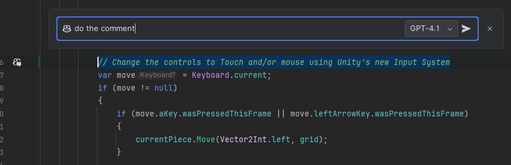
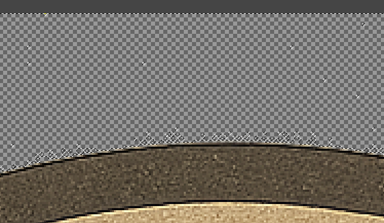
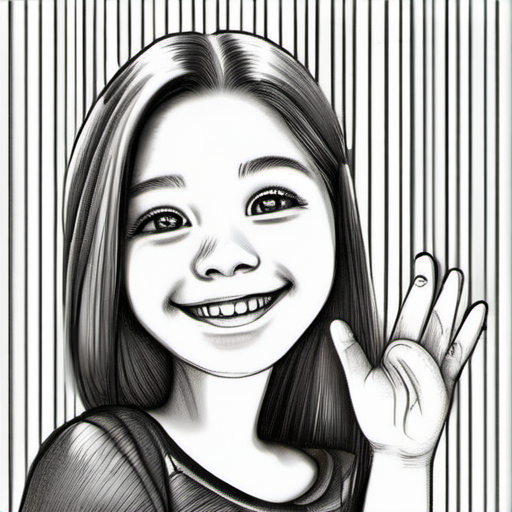

# UnityAiTesting

Case Study: how to build small casual games trying to take the maximum advantage of AI.

## Architecture

This project follows a Toolbox pattern along with a variant of the MVC (Model-View-Controller) architecture, commonly used in Unity projects.

*Toolbox*
This is a variant of a `Singleton` pattern but with one only singleton in the game, the Toolbox. This gives access to all other systems. This choice was made to keep the code simple and flexible, such an approach allows to easily set up multiple scenes and play from them directly with valid states.

*Model*
Data structures that encapsulate the data and logic for the mini games. For example: `WoodokuGrid`, `WoodokuPiece`, and `WoodokuGameConfig` classes represent the game state, rules, and configuration. 

*View*
Unity GameObjects, such as the grid cells, pieces, and UI elements (TMP_Text for score), act as the View. They visually represent the game state to the player. The DrawGrid and UI update code in `WoodokuController` update these views.

*Controller*
It handles user input, updates the model (game state), and refreshes the view. It manages game flow, piece spawning, score updates, and win/loss conditions. The `WoodokuController` class acts as the Controller, as well as `Manager` classes.

This separation keeps game logic, UI, and input handling organized and maintainable.

## AI Used

Since the purpose was to try to "abuse" AI, a substantial time has been dedicated to trying to get an AI to build as much of the project as possible. Several AIs have been tested and used, with various degrees of success.

### For Coding
 - ChatGPT

For writing individual modules, it works great. I have not tested coding with ChatGPT and a token for integrating or providing custom context. It has a tendency to loop around wrong solutions, in those cases, it's better to just drop the conversation and start a new one. Just like Copilot, they do tend to "hallucinate" non-existing APIs.

 - Gemini

Mostly I only used Gemini from the Google Search, I was surprised that sometimes it gave very correct answers when ChatGPT would not even come close, but I relied more on the other AIs.

 - Copilot

Having an AI integrated into the project should be very useful. For repetitive tasks it proves quite useful, but falls very short for almost any complex task. The integration with JetBrains Rider is still not the best, resulting in Copilot writing big chunks of code out of place and breaking a document rather often (tested on both an M3 Pro chip and a Ryzen 9 7900X, it happens less often in the latter, but still happens). It is quite convenient that it can read comments you're writing and then proposes code for it, but it's not always providing a result for it. Some times I would resort to simply selecting the comment, opening the inline chat and telling Copilot to "just do it".

 - Claude.ai

I was impressed with how much detail it can put into building an entire system. I tried just telling it to create the entire game, with all mini-games, and it did generate lots of code for it. The code was gramatically correct, although many parts did not make sense (e.g. you tell it to use pooling, it creates a pool, declare it in a class and immediately after start instantiating and destroying objects, ignoring the pool). It also generated lots of unused code and variables. Sadly trying to improve iteratively did not help much, even giving brand new commands with much more detail. The less detailed the command, the better it behaved.

All the code for the mini-games was based on the first iteration from Claude.ai, ColorSort and BlockJam are still almost untouched (just reformatted, simplified and adapted to no longer existing systems). The original commit that included all the code [can be seen here](https://github.com/lumley/UnityAiTesting/commit/5b578634117430f3e4150e371263ffe46ad68f87).

### For Art

 - ChatGPT

Seems to understand quite well what's the requirements of the image, but it's very unflexible in the output (usually ignores sizes, or margins). In addition, it seems to generate grain on every image which is noticeable when zooming or when trying to crop areas that should be fully transparent.

 - Stable Diffusion

I had a local set up since 2024 which I thought I could put to test. Unfortunately it seems like it broke after some updates on Windows and I could not get it to provide images of any acceptable quality. I grew a bit rusty on the prompting but thankfully other AIs are good at telling you what to write. In the past it generated images such as this:

But this time the attempts kept on breaking or throwing "out of memory" exceptions, at that point I decided to skip this part:

  

Or one of the very sad attempts at building a checkmark:

### Exploring other forms of AI integration

Given that the programming aspect was not yielding positive enough results, I decided to explore other paths for integrating AI. Unity already offers Unity Muse (soon to be renamed Unity AI) but the Editor is flexible enough that one can integrate other AIs. Easy options are:

 - Auto-translation of in-game text

With a simple DeepL token (or any other AI of choice), one can run a procedure to translate text in batch and write it into a file that is processed in the editor after opening. The process is rather simple but one needs to set up scripts for importing the text into Unity's localization package, or set it up to download from a remote Excel (or Google Sheet) file.

 - External asset generation (included a demo)

Unity has `AssetPostprocessor`s, which are classes triggered before and after assets of given types are imported or updated in the project. The idea was to automatically generate game blocks the moment one adds a sprite in a suitable folder. The test can be found in `SpriteAssetPostprocessor`, it reads for sprites being updated in a specific folder and automatically creates a variant of a specific "Block" asset.

While I've built scripts like this before, this is one instance where ChatGPT managed to deliver a fully functional script, with only very minor personal touches.

## Things that didn't make it
 - Sound! I could not easily find AIs that would generate so I decided to leave the project silent.
 - Use Localization and integrate auto-translation of the localization assets in Editor (not in runtime).
